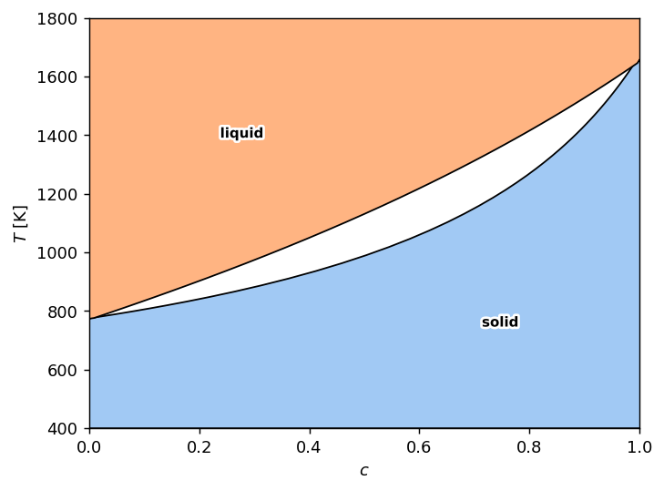
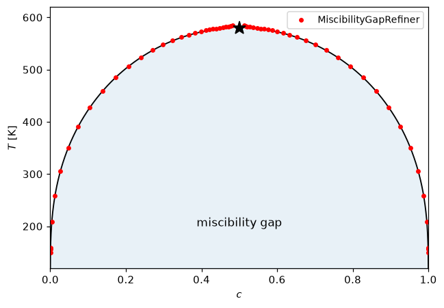
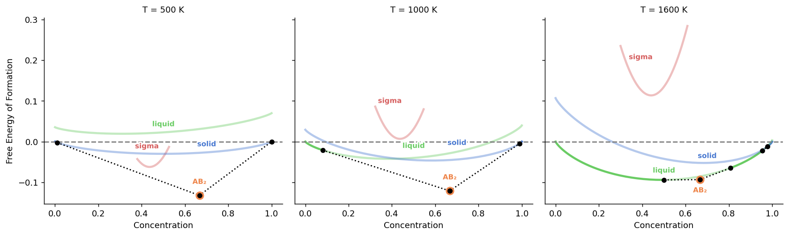
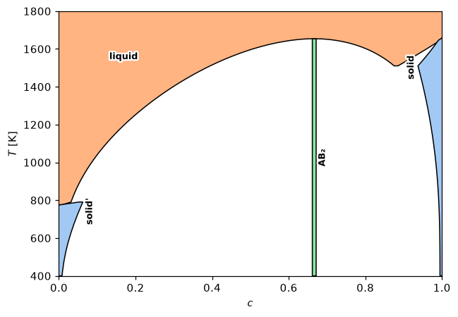

# Changelog

Notable changes to **landau.py**, newest first. Per-PR detail lives in the
[GitHub releases](https://github.com/eisenforschung/landau/releases).

## [1.11.0](https://github.com/eisenforschung/landau/compare/1.10.0...1.11.0) (2026-07-06)


### Features

* **calculate:** accept explicit refiner list in calc_phase_diagram ([#311](https://github.com/eisenforschung/landau/issues/311)) ([a8d3ad7](https://github.com/eisenforschung/landau/commit/a8d3ad70049fb430f9a9c6696d014fd4c294560e))
* **refine:** add dc_max concentration-drift floor to CC tracers ([#308](https://github.com/eisenforschung/landau/issues/308)) ([134843c](https://github.com/eisenforschung/landau/commit/134843c4dbaa82ee0c5c75ffb44ab6a6e3e1e7ff))
* **refine:** add dc_min concentration-drift floor; kwarg-only CC ctors ([#312](https://github.com/eisenforschung/landau/issues/312)) ([54e8c5b](https://github.com/eisenforschung/landau/commit/54e8c5b3a4b6aef47184f1cab3d5e4714ddc92da))


### Bug Fixes

* **phases:** anchor check_concentration_interpolation plot_excess to line phases' own concentrations ([#322](https://github.com/eisenforschung/landau/issues/322)) ([aba45cc](https://github.com/eisenforschung/landau/commit/aba45ccf8b86f85ae652de6237d45b5aaaf6ec1b))

## [1.10.0](https://github.com/eisenforschung/landau/compare/1.9.0...1.10.0) (2026-06-23)


### Features

* FastInterpolatingPhase, a vectorized exact replacement for SlowInterpolatingPhase ([#281](https://github.com/eisenforschung/landau/issues/281)) ([2990231](https://github.com/eisenforschung/landau/commit/29902310e3fdde09dbcfb887b7241e412b4dd38c))
* **interpolate:** add SplineFit concentration interpolator ([#274](https://github.com/eisenforschung/landau/issues/274)) ([edb5f35](https://github.com/eisenforschung/landau/commit/edb5f355761b296be578df70599a1085aa7c534c))


### Bug Fixes

* **calculate:** bound guess_mu_range brute scan to its search bracket ([#275](https://github.com/eisenforschung/landau/issues/275)) ([f0aac34](https://github.com/eisenforschung/landau/commit/f0aac34c93a4b8314d4cdb8168a724f9c4f488bf))

## 1.8.11 — 2026-06-11
- `ScanRefiner` recovers the two transitions around a stable window narrower than the scan grid.
- Off-polygon inline labels fan apart vertically when their horizontal extents overlap.
- `f_excess` endpoint reference compared at the pure concentrations, so a terminal line phase keeps `f_excess = 0`.

## 1.8.10 — 2026-06-10
- Segment-TSP tours rotated off their intra-segment edge to stop self-intersecting polygons.
- Inline polygon labels rotate, then offset, when the horizontal label does not fit.
- Single-temperature excess-free-energy plot draws onto the current axes.

## 1.8.9 — 2026-06-10
- Recover phase polygons when `make_valid` returns a `GeometryCollection` (needs `shapely >= 2.1`).
- New quickstart and example gallery in the README.
- Minimum-dependency CI exercises every declared lower version bound.

## 1.8.8 — 2026-06-09
- Single-temperature `f_excess` branch simplified; no title on the single-T excess plot.

## 1.8.7 — 2026-06-09
- Single-temperature excess free energy drawn as a plain line plot.

## 1.8.6 — 2026-06-09
- Inline phase labels on the excess-free-energy facets.
- 1d transition labels spread horizontally and kept off the lines.
- `_scalarize` collapses 0-d arrays to scalars in one place.

## 1.8.5 — 2026-06-08
- White outline on 1d transition marker labels.

## 1.8.4 — 2026-06-07

Phase names now sit inside the diagram by default; the legend box is dropped unless you ask for it.

```python
plot_phase_diagram(df)                       # labels placed in each region
plot_phase_diagram(df, inline_legend=False)  # fall back to the legend box
plot_phase_diagram(df, legend=False)         # bare polygons
```



- New `PlotGallery` notebook.
- 1d dashed branches bridged to the exact transition; bold mathtext subscripts in labels.

## 1.8.3 — 2026-06-03
- `reference_phase` subtracts a chosen phase's potential along 1d cuts.
- 1d plots label phases on the spine instead of a seaborn legend.

## 1.8.2 — 2026-06-03
- `col_wrap` clamped to the number of temperatures in `plot_excess_free_energy`.

## 1.8.1 — 2026-06-03
- 1d phase diagrams segmented by stability flips, not distance clustering.
- `boundary_id` column tags refined rows by coexistence line.
- `f_excess` reference picks the most stable endpoint phase.

## 1.8.0 — 2026-06-02

The largest release so far: a refiner strategy for phase boundaries, ASE as a
free-energy source, and the excess-free-energy view.

**Trace coexistence lines and miscibility gaps.** The new `Refiner` strategy
refines phase boundaries. `ClausiusClapeyronRefiner` and `MiscibilityGapRefiner`
follow a coexistence line — including a miscibility gap *inside* a single phase —
by predictor–corrector tracing.

```python
from landau.calculate import calc_phase_diagram, refine_phase_diagram
from landau.refine import MiscibilityGapRefiner

coarse = calc_phase_diagram([solution], Ts=Ts, mu=mus, refine=False, keep_unstable=True)
df = refine_phase_diagram(coarse, {"solution": solution}, refiners=[MiscibilityGapRefiner()])
```



**Look under the hood with `plot_excess_free_energy`.** Free-energy curves,
metastable phases and the common-tangent constructions behind a diagram.

```python
df = calc_phase_diagram(phases, Ts=[500, 1000, 1600], mu=200, keep_unstable=True)
plot_excess_free_energy(df, convex_hull=True)
```



**Pull free energies from ASE.** `AsePhase` wraps an
`ase.thermochemistry.ThermoChem` object as a phase.

```python
from landau import AsePhase
phase = AsePhase("gas", fixed_concentration=0.0, thermochem=thermo)
```

- Segment-clustered TSP is the new default for drawing phase-region polygons.
- `distance_threshold` exposed on the cluster helpers and `get_polygons`.
- New `PointDefects` notebook; `testplot` CI rendering of review diagrams.

## 1.7.0 — 2026-04-02
- New n-dimensional (Whitney RBF) interpolator.
- `interpolate` split into a subpackage; `__all__` added across modules.
- Read the Docs build and a test CI workflow.
- pandas 3.0 `groupby().apply()` fix.

## 1.6.0 — 2025-11-27
- New interpolator; `SlowInterpolatingPhase` refactor.
- Fixed the PyPI description.

## 1.5.2 — 2025-10-23
- Require Python ≥ 3.11.

## 1.5.1 — 2025-10-23
- Allow `pyiron_snippets >= 1, < 2`.

## 1.5.0 — 2025-10-21

TSP-ordered polygons for phase regions — the default when `python-tsp` or
`fast-tsp` is installed.

```python
plot_phase_diagram(df, poly_method="fasttsp")
```



- More `check_interpolation` diagnostics.

## 1.4 — 2025-09-19
- New phase computing the exact semigrand potential instead of the earlier approximation.

## 1.3.5 — 2025-09-15
- Fixed the colour legend in 1d phase diagrams.

## 1.3.4 — 2025-08-12
- 1d phase diagrams split into segments for plotting.
- `min_c_width` fixed for concave polygons.
- Mg–Ca example added.

## 1.3.3 — 2025-07-17
- More options for `plot_1d_T_phase_diagram`.

## 1.3.2 — 2025-06-22
- Renamed the PyPI package to **landau**.
- Ideal-solution notebook; steadier c–T plotting for phases with disconnected stable regions.

## 1.3.1 — 2025-05-25
- Zenodo release.

## 1.3.0 — 2025-04-29
- Defected phases work again.
- Better `InterpolatingPhase` numerics and interpolation.

## 1.2.3 — 2025-04-01
- 1d temperature/chemical-potential phase-diagram function.
- `poly_method` argument for plotting; intro notebook; stability fixes.

## 1.2.2 — 2025-03-31
- `polyfit` made an optional dependency.

## 1.2.1 — 2025-03-27
- Steadier segment sorting for plotting.

## 1.2.0 — 2025-03-26
- Polynomial fitting gains L2 regularization, automatic order selection and curvature constraints.

## 1.1.1 — 2025-03-23
- Stability fixes.

## 1.1.0 — 2025-03-19
- `guess_mu_range` autodetects the chemical-potential sampling window.

## 1.0.0
- Initial release.
